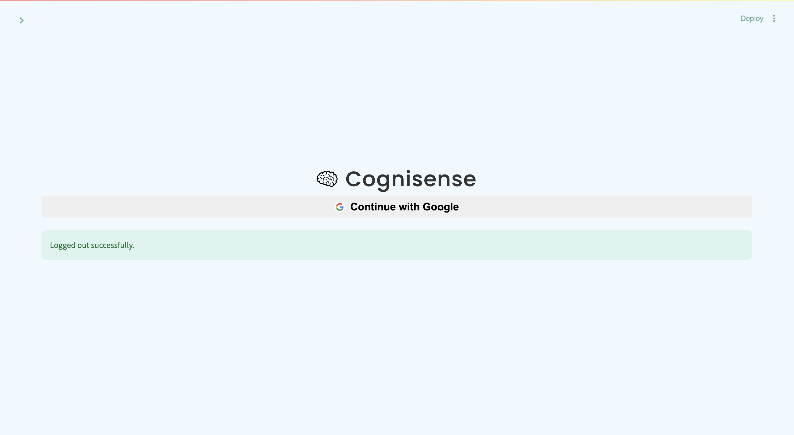
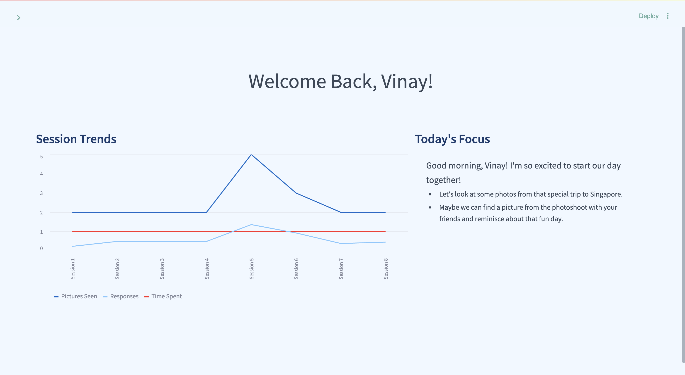
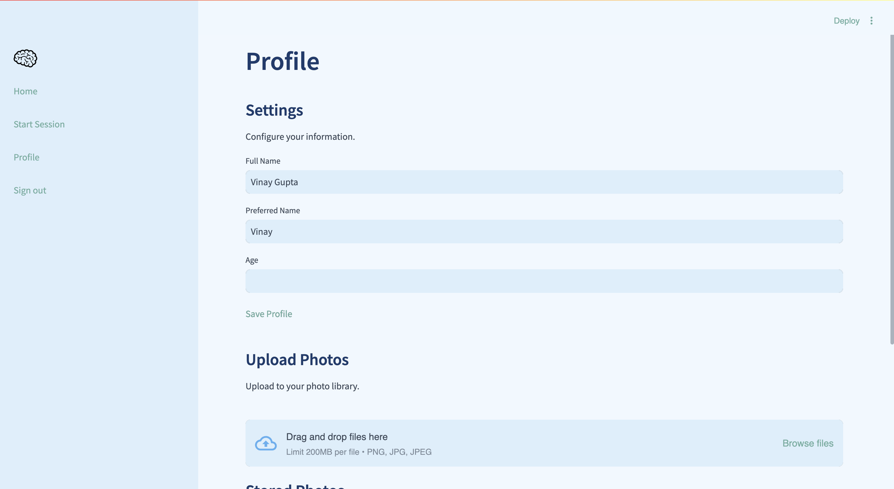
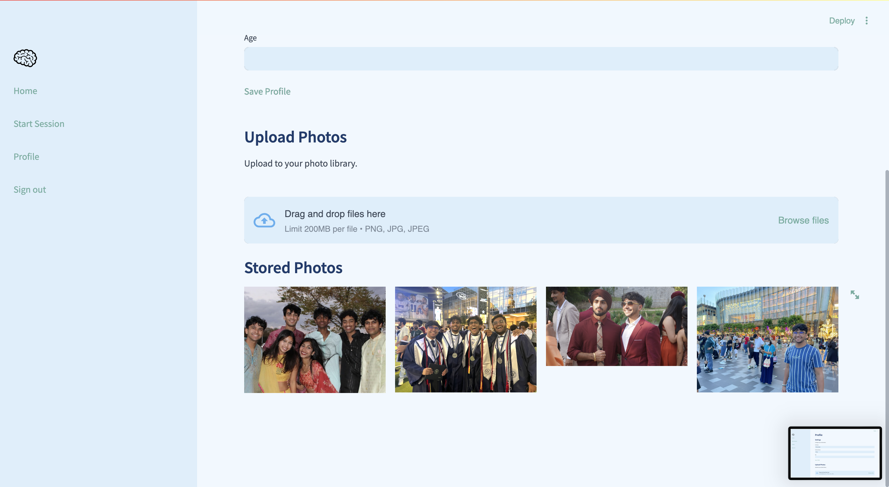

# Cognisense
## A conversational assistant that revitalizes memories, fosters deep emotional connections, and empowers Alzheimer’s and Dementia care with intelligent, personalized therapy.


Cognisense is an innovative AI-driven application designed to help Alzheimer's and dementia patients reconnect with their memories and maintain relationships with loved ones. By leveraging advanced AI technologies, Cognisense provides a supportive, interactive experience for patients to explore their personal photo galleries and engage in meaningful conversations about their past.

### Key Features
- AI-powered image analysis and contextualization
- Interactive, voice-based conversations about personal memories
- Personalized memory prompts based on cutting-edge Alzheimer's research
- Progress tracking and analytics for caregivers and healthcare professionals
- Secure storage and management of personal photo galleries

<br />

### Watch the demo here!
[](https://www.youtube.com/watch?v=YxRf4Va3rPQ)


### Run the code

<br />

Run the code

```
git clone https://github.com/leapingturtlefrog/AI-ATL-24.git
```

```
cd AI-ATL-24
```

```
terraform init
```

```
terraform apply
```

Take down the container

```
terraform destroy
```


## Here are some images of the app
<br />







